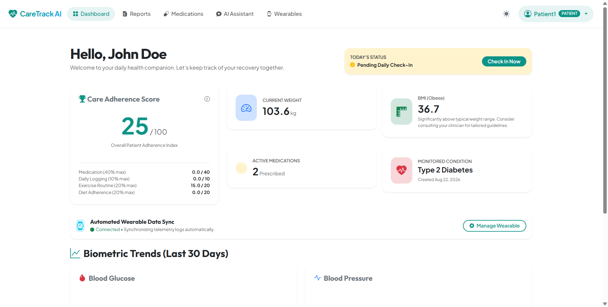
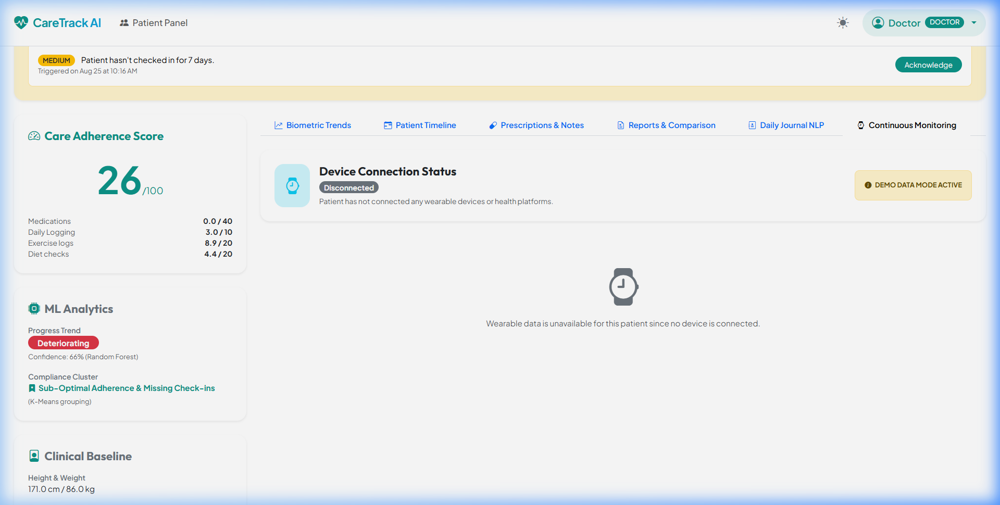
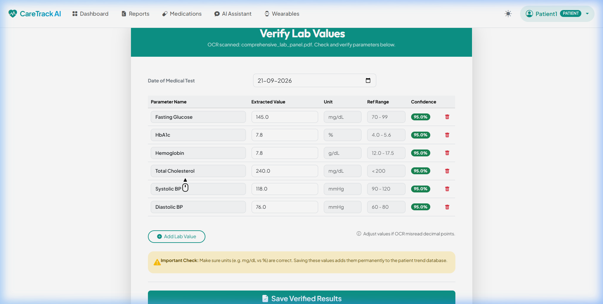
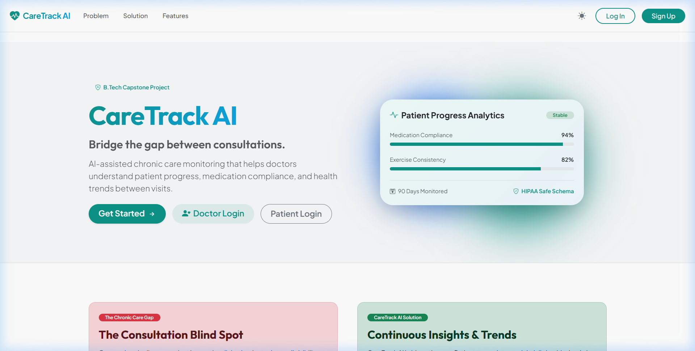

# CareTrack AI
### AI-Assisted Chronic Disease Monitoring & Clinical Decision Support Platform

CareTrack AI is a medical-grade chronic disease monitoring and clinical decision support system. It is designed to assist clinicians in supervising chronic patients (Diabetes, Hypertension, Obesity, Cholesterol) between consultations by analyzing structured health logs, medical lab reports (via PDF OCR), medication adherence, symptoms, and historical trends.

---

## ⚠️ Important Clinical Disclaimer
> [!IMPORTANT]
> **CareTrack AI is NOT a diagnostic tool and does NOT replace professional medical advice or clinicians.**
> - The system does not diagnose new conditions or make independent treatment changes.
> - The AI Assistant is restricted to educational guidelines, recommending consultation before any modifications.
> - The attending doctor remains the final decision-maker.

---

## 🚀 Key Features

### 1. Doctor Dashboard & Patient Management
- **Clinical Telemetry Trends:** Real-time interactive graphs for Blood Glucose, Blood Pressure, and Body Weight.
- **Biometric Analytics & Alerts:** Dynamic AJAX alert notifications for critical biometric deviations (e.g. Systolic BP > 140 mmHg) and compliance drop-offs.
- **AI-Generated Clinical Summaries:** Dynamic 30-day markdown summaries of patient logs using Gemini API (with a robust statistical fallback generator if the API key is missing) incorporating wearable telemetry trends.
- **ML Progress Predictions:** Active Random Forest classifier categorizing patient progress as *Improving*, *Stable*, or *Deteriorating* based on daily metrics.
- **ML Care Archetypes:** K-Means clustering algorithm grouping patients into adherence profiles (*Highly Compliant*, *Struggling*, *Sub-Optimal*).
- **Continuous Wearable Monitoring Panel:** Clinic-facing dashboard presenting patient device connection status, activity scores, resting heart rate curves, sleep drift, and weight trends.

### 2. Patient Dashboard & Telemetry Logging
- **Daily Check-in Tracker:** Logging for blood glucose, blood pressure, weight, sleep, diet compliance, mood, energy, and physical symptoms.
- **Medication Adherence Widget:** Weekly check-off schedule widget updating care compliance via AJAX.
- **AI Health Assistant:** Interactive educational chatbot with RAG matching (NumPy Jaccard overlap) querying WHO & AHA lifestyle guidelines.
- **Wearable Device Integration Center:** Connects third-party APIs (Fitbit, Apple Health, Android Health Connect) to synchronize steps, resting heart rate, SpO2, sleep, and scales weights.

### 3. Medical Report Digitization (OCR)
- **PDF Extraction:** Extracts clinical variables (HbA1c, Fasting Glucose, Lipid profiles, Blood Pressure) from uploaded medical report PDFs using PyMuPDF and Tesseract OCR.
- **Interactive Review Panel:** Allows clinicians to review, override, and confirm extracted lab parameters before saving.

### 4. Continuous Monitoring Telemetry
- **Dynamic Data Syncing:** Consent-guarded provider framework syncing historical trends (7/30/90 days) dynamically with duplicate prevention constraints.
- **Biometric Flagging Engine:** Auditable telemetry parser checking physiological bounds and flagging low-confidence sensor entries.
- **Missing Telemetry Warnings:** Automatically flags clinicians with active warnings if the patient has not synchronized a device within 48 hours.

---

## 📸 System Screenshots

| Figure | Description | Preview |
| :--- | :--- | :--- |
| **Fig. 5.1** | **Patient Dashboard**<br>Adherence index, biometrics, condition tags, wearable sync status, and trend curves. |  |
| **Fig. 5.2** | **Doctor Continuous Monitoring Panel**<br>Clinician telemetry panel, device connection monitoring, and ML risk clusters. |  |
| **Fig. 5.3** | **OCR Report Review Screen**<br>PyMuPDF/Tesseract parameter extraction verification table with confidence scores. |  |
| **Fig. 5.4** | **Landing & Authentication**<br>Modern glassmorphism landing interface and secure role-based login screen. |  |

---


## 🛠️ Technology Stack
- **Backend:** Flask, Flask-SQLAlchemy (SQLite database), Flask-WTF, Flask-Login
- **Frontend:** HTML5 (Semantic Structure), Vanilla CSS (Sleek dark mode/glassmorphism design system), Vanilla JS (AJAX endpoints)
- **Natural Language Processing:** spaCy (`en_core_web_sm`) dependency negation parser
- **Computer Vision:** PyMuPDF, PyTesseract OCR
- **Machine Learning:** Scikit-Learn (Random Forest, Logistic Regression, K-Means), Joblib
- **Generative AI:** Google Gemini API (`google-generativeai`)

---

## 📁 Repository Structure
```
caretrack-ai/
│
├── app/
│   ├── models/            # SQLAlchemy Database Models (User, Patient, Doctor, DailyHealthLog, etc.)
│   ├── routes/            # Flask Blueprints (auth.py, doctor.py, patient.py, ai.py, reports.py)
│   ├── services/          # Pure service modules (ai_service.py, ocr_service.py, compliance_engine.py, etc.)
│   ├── static/            # Static styles.css and main.js (Dark theme persistence)
│   ├── templates/         # Jinja2 Layout Templates (Base layouts, Auth, Doctor, Patient)
│   ├── ml/                # ML module (preprocessing.py, train.py, inference.py, models/)
│   └── __init__.py        # Flask App Factory
│
├── notebooks/
│   └── ml_pipeline.ipynb  # Jupyter demonstration notebook for model fitting
│
├── scripts/
│   └── seed_database.py   # Seeding script with 90 days of synthetic data for 20 patients
│
├── tests/
│   └── test_services.py   # Pytest unit tests
│
├── instance/              # SQLite Database folder
├── config.py              # Environment settings
├── app.py                 # Application launcher
└── .env                   # Configuration variables
```

---

## 💻 Getting Started

### 1. Prerequisites
- Python 3.14+
- Tesseract OCR (Windows Path: `C:\Program Files\Tesseract-OCR\tesseract.exe`, macOS: `/opt/homebrew/bin/tesseract` or `/usr/local/bin/tesseract`, Linux: `/usr/bin/tesseract`)

### 2. Installation
Clone the repository and install the dependencies:
```bash
# Initialize Virtual Environment
python -m venv venv
.\venv\Scripts\activate

# Install dependencies
pip install -r requirements.txt
```

### 3. Environment Variables
Create a `.env` file in the root directory:
```env
FLASK_APP=app.py
FLASK_DEBUG=True
SECRET_KEY=your_secret_session_key
GEMINI_API_KEY=your_google_gemini_api_key
# Set to correct binary path. On non-Windows/Linux, customize this as needed.
TESSERACT_PATH=C:\Program Files\Tesseract-OCR\tesseract.exe
MAX_CONTENT_LENGTH=16777216
```

### 4. Seed the Database
Run the seed script to populate 20 patients, 90 days of daily log history, medical reports, and alerts:
```bash
python -m scripts.seed_database
```

### 5. Running the Application
Start the Flask development server:
```bash
flask run
```
Access the application at `http://127.0.0.1:5000/`.

**Default Login Credentials:**
*   **Clinician:** `doctor@caretrack.ai` / `doctor123`
*   **Patient Demo:** `patient1@caretrack.ai` / `patient123`
*   **Administrator:** `admin@caretrack.ai` / `admin123`

---

## 🧪 Running Unit Tests
Execute the test suite (including the new wearable sync integration tests) using `pytest`:
```bash
pytest tests/
```

---

## 📚 Documentation
For details on continuous health data integration and mock platforms, see [Wearable Integration Architecture](file:///C:/Users/risha/.gemini/antigravity-ide/scratch/caretrack-ai/docs/wearable_integration.md).
